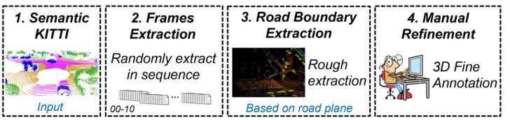

IEEE TRANSACTIONS ON INTELLIGENT TRANSPORTATION SYSTEMS
3
transformation of input 3D point cloud data into 2D view images or voxelization. [36] uses camera images, LiDAR, and elevation gradients of LiDAR as inputs, employing convolutional recurrent networks to extract road boundaries in 2D BEV images to construct semantic maps. [25] projects motion-accumulated 3D point cloud data onto 2D BEV images, initially detecting visible road edges through a U-Net network [37], followed by predicting obscured road boundaries using multi-layer convolutional networks with expanded receptive fields [38]. Similarly, [24] proposes a two-stage curb detection framework, initially employing U-Net for visible curb detection, then incorporating uncertainty quantification to improve detection performance in obscured areas.
Compared to traditional methods, these approaches demonstrate robustness in various driving environments and reduce the burden of manual parameter tuning. However, converting point clouds to 2D images results in significant loss of 3D information, especially the height difference features crucial for distinguishing curbs from other categories. [39] explores voxelizing the raw 3D point cloud as a superimage input to the model, using CNNs to detect road edges and lane markings, but its recognition accuracy remains low. LCDeT [26] employs a Transformer model for curb detection in voxelized point clouds, introducing dual attention mechanisms in both temporal and spatial dimensions to ensure detection stability and accuracy. Yet, this method relies on complex model structures and high-resolution LiDAR sensors.
Some general point cloud segmentation models [40]–[42] have achieved accurate 3D point cloud detection using relatively simple model structures. Among them, 3D U-Net [40] is a popular model for 3D volumetric data processing, adapted for point cloud segmentation by learning the spatial hierarchies of features. Cylinder3D [41] is a voxel-based method specifically designed to handle large-scale point clouds by projecting them into cylindrical grids, enabling more efficient feature extraction in 3D space. P.W.K [42] is an improvement of Cylinder3D based on knowledge distillation, focusing on transferring knowledge from a large teacher model to a smaller student network to enhance segmentation performance. However, these models are not specifically designed to extract curb features, which are crucial for curb detection tasks.
Our proposed method uses original point cloud as input, preserving more 3D feature information. Addressing the uneven distribution of curb point cloud feature and the easy loss of curb height difference information, we introduce a multi-scale and channel attention mechanisms to enhance performance.
C. Curb Detection Datasets
There is a significant amount of research in LiDAR-based curb detection; however, high-quality datasets with 3D annotations are scarce. Major automotive datasets such as NuScenes [43], KITTI [44], and SemanticKITTI [45] do not include curb annotations. The robustness of deep learning methods is closely related to the volume of data collected under various environmental conditions. These factors have somewhat hindered the application of deep learning methods in this task. [19] created a public dataset for curb detection, comprising

Fig. 2. 3D-Curb dataset construction process. Mainly developed based on the standard SemanticKITTI dataset.
TABLE I COMPARISON OF RELATED CURB DATASETS.
<table><tr><td>Dataset</td><td>LiDAR</td><td>Public</td><td>Frames</td><td>3D labeling</td><td>Categories</td></tr><tr><td>Zhang [19]</td><td>32-line</td><td>Yes</td><td>200</td><td>No</td><td>1</td></tr><tr><td>Liang [36]</td><td>-</td><td>No</td><td>-</td><td>No</td><td>1</td></tr><tr><td>Suleymanov [25]</td><td>-</td><td>No</td><td>-</td><td>No</td><td>1</td></tr><tr><td>Uncertainty [24]</td><td>32-line</td><td>Yes</td><td>5224</td><td>No</td><td>2</td></tr><tr><td>NRS [26]</td><td>128-line</td><td>Yes</td><td>6220</td><td>No</td><td>2</td></tr><tr><td>3D-Curb (ours)</td><td>64-line</td><td>Yes</td><td>7100</td><td>Yes</td><td>29</td></tr></table>
200 scans collected across five different scenes. [24] developed a public dataset for curb detection, including 5200 scans with BEV labels, collected from urban areas. LCDeT [26] introduced a curb dataset for 128-line LiDAR, containing 6200 frames of point clouds from urban road scenes, both during daytime and nighttime. [27] proposed a method for 3D curb detection and annotation in LiDAR point clouds, effectively reducing manual annotation time by \(50\%\).
The above-mentioned curb point cloud datasets only label the curb category, which cannot be directly used in autonomous driving scenarios, as recognition of other categories such as vehicles and roads is also necessary. Similarly, other categories surrounding the curb line, like roads and sidewalks, can also assist the model in more accurately learning curb features. Based on the existing large SemanticKITTI dataset, we added annotations for the curb category, thereby covering a richer array of real road scenes, totaling up to 7100 frames of point cloud data. To our knowledge, this is currently the largest and most comprehensive curb point cloud dataset with annotations relevant to autonomous vehicles (AV). Table 1 illustrates the related LiDAR datasets for curb detection.
III. METHODOLOGY
A. 3D-Curb Dataset Construction
Compared to other autonomous driving scenarios, there is a significant lack of relevant curb point cloud datasets, especially those with 3D annotations. Building on the large-scale open-source SemanticKITTI dataset [45], we have developed and introduced the 3D-Curb dataset. This dataset retains the original 28 semantic categories while adding a new curb category. It was collected using a Velodyne HDL-64E LiDAR, providing comprehensive views of various street scenes as a general-purpose autonomous driving dataset.
The construction process of our dataset is illustrated in Fig. 2. Due to the high-frequency data acquisition of the SemanticKITTI dataset, the high similarity between frames can lead to model overfitting and significantly increase the