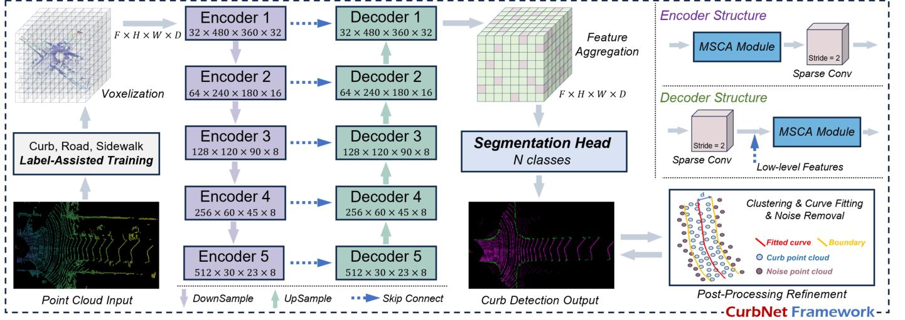

IEEE TRANSACTIONS ON INTELLIGENT TRANSPORTATION SYSTEMS
4

Fig. 3. Overview of proposed CurbNet framework. From left to right, first is point cloud data input and voxelization. Then there is a 5-layer deep encoder-decoder structure. Next comes the feature aggregation and segmentation head. Finally, the post-processing refinement of the detection results.
annotation workload. Therefore, we randomly selected 7100 representative frames from sequences 00-10. We utilized the high-quality road annotations provided by the SemanticKITTI dataset and applied the Ground Plane Fitting method proposed by [46] to extract the boundaries within the road labels. We then extended these parameters to obtain the curb labels. However, due to static/dynamic obstacles and other occlusions, these automatically generated curb annotations contained many inaccuracies. Thus, we manually refined the curb labels in the BEV perspective to ensure high-quality annotations. The 3D-Curb dataset focuses on curb annotations in the forward direction of vehicle travel, with an average range of \(40.43\) meters along the forward y-axis. To accentuate the curb areas, the lateral x-axis range is set to 1.3 times the road width.
To the best of our knowledge, this is the largest curb point cloud dataset to date and the only one with 3D annotations. Table I compares our dataset with other related curb datasets.
B. Overview of Model Framework
As illustrated in Fig. 3, the CurbNet framework comprises four main components: point cloud input with voxelization, feature extraction, feature aggregation to segmentation, and post-processing refinement.
In most road scenarios, curbs are primarily located at the junction between the road and the sidewalk. To enhance the model's ability to learn curb features, we introduced additional labels for the road and sidewalk during the training process. To align the input point cloud data with physical space characteristics (where the density of circularly scanned point clouds decreases with increasing distance), we partition the voxel blocks based on the point cloud distance. This approach minimizes the impact of uneven point cloud distribution.
During the feature extraction stage, voxelized features with dimensions  \( F \times H \times W \times D \)  are fed into a 5-layer deep encoder-decoder structure. Each encoder and decoder backbone incorporates the MSCA module, specifically designed for curb point cloud feature extraction. A stride-2 sparse convolution is employed as the pooling function.
Subsequently, the high-dimensional voxelized features  \( (F \times H \times W \times D) \)  are aggregated and then input into the segmentation head to obtain the detection results. Finally, the curb detection results undergo post-processing involving multiclustering, fitting, and noise removal to further enhance detection accuracy.
The integration of these components within the CurbNet framework enables robust and precise curb detection, addressing the challenges posed by varying point cloud densities and the complex spatial characteristics of road environments.
C. Multi-Scale and Channel Attention (MSCA) Module
The structure of the MSCA module, illustrated in Fig. 4, serves as a fundamental component of the encoder-decoder architecture. The MSCA module is composed of two main parts: multi-scale fusion and channel attention.
Multi-Scale Fusion. Curbs in point clouds typically form a long curve along both sides of the road. However, as the LiDAR scanning distance increases, the point cloud density decreases, leading to sparser curb features. This results in significant scale differences in the features represented by the same number of point clouds at different distances after voxelization. To address this, we designed the MSCA module with a multi-scale fusion strategy. We employ convolution groups with different strides (1, 3, 5) to construct a feature pyramid, and then use dense pyramid connections to deeply fuse the output features of different scales. Inspired by text detection methods [47], we adopt three asymmetric sparse convolution kernels to target the regions in the xy, xz, and yz planes within the voxel space. This approach captures multi-dimensional curb feature information. Compared to traditional 3×3×3 convolutions, the combination of asymmetric sparse convolutions offers higher computational efficiency while maintaining the same receptive field.
Formally, given the input feature map  \( X \in R^{F \times H \times W \times D} \) , where  \( F \times H \times W \times D \)  denotes the spatial dimensions, we apply convolutions with varying strides to capture multi-scale features. Specifically, the input is processed using sparse con-