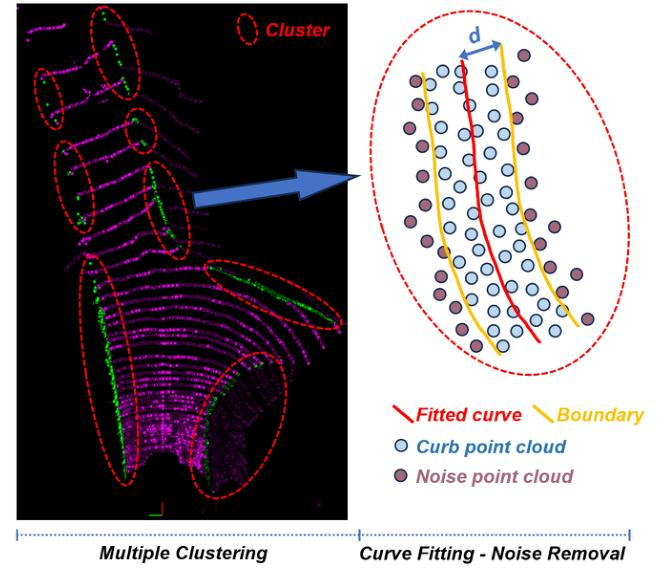

IEEE TRANSACTIONS ON INTELLIGENT TRANSPORTATION SYSTEMS
6
Here,  \( \gamma^{i} \)  is decomposed into a class-agnostic parameter  \( \gamma_{a} \)  and a class-specific parameter  \( \gamma_{b}^{i} \) . The parameter  \( \gamma_{a} \)  represents the basic focusing factor under balanced data scenarios, while  \( \gamma_{b}^{i} \geq 0 \)  is a variable parameter related to the imbalance degree of class i. The term  \( \eta^{i} = N_{i}/N \)  where N is the total number of points in the point cloud, and  \( N_{i} \)  is the number of points in class i. The value of  \( \eta^{i} \)  is constrained to the range [0, 1], and  \( 1 - \eta^{i} \)  inversely reflects the weight for low-frequency classes. The hyperparameter s is a scaling factor that determines the upper limit of  \( \gamma^{i} \) .
Dynamic Weight Factor. While the adaptive focusing factor  \( \gamma^{i} \)  ensures more loss contribution from rare samples, it does not fully resolve the class imbalance problem. Therefore, we introduce a dynamic weighting factor  \( \omega^{i} \)  to provide higher weights for rare classes:
\[
\omega^ {i} = \frac {1}{\log (\delta + \eta^ {i})} \tag {12}
\]
where  \( \delta \)  is a small constant to prevent division by zero.
Combining these components, the final ACE Loss is expressed as:
\[
\begin{array}{l} \mathcal {L} _ {A C E} \left(p _ {i}\right) = - \alpha_ {i} \omega^ {i} \left(1 - p _ {i}\right) ^ {\gamma^ {i}} \log \left(p _ {i}\right) \\ = - \sum_ {i = 1} ^ {C} \alpha_ {i} \frac {1}{\log (\delta + \eta^ {i})} (1 - p _ {i}) ^ {\gamma_ {a} + \eta_ {b} ^ {i}} \log (p _ {i}) \tag {13} \\ \end{array}
\]
The ACE Loss effectively prioritizes the learning of rare class samples by dynamically adjusting both the focusing factor and the class weights based on the distribution of point cloud data, thereby addressing the critical issue of class imbalance in curb detection.
2) Lovász-Sofimax Loss
Lovász Loss is particularly effective in handling imbalanced datasets and excels in addressing sparse boundary issues  \( [50] \) . Compared to traditional cross-entropy loss, it demonstrates superior performance in terms of Intersection over Union (IoU) scores. For a given true label vector  \( y^{*} \)  and a predicted label vector  \( \tilde{y} \) , the IoU index for class c is defined as:
\[
\mathrm{IoU} _ {c} \left(\boldsymbol {y} ^ {*}, \widetilde {\boldsymbol {y}}\right) = \frac {\left| \left\{\boldsymbol {y} ^ {*} = c \right\} \cap \left\{\widetilde {\boldsymbol {y}} = c \right\} \right|}{\left| \left\{\boldsymbol {y} ^ {*} = c \right\} \cup \left\{\widetilde {\boldsymbol {y}} = c \right\} \right|} \tag {14}
\]
This index provides the ratio between the intersection and union of the true and predicted masks within the range  \( [0, 1] \) , with the convention 0/0 = 1. The corresponding loss function employed in empirical risk minimization is:
\[
\Delta_ {\mathrm{IoU} _ {c}} \left(\boldsymbol {y} ^ {*}, \widetilde {\boldsymbol {y}}\right) = 1 - \mathrm{IoU} _ {c} \left(\boldsymbol {y} ^ {*}, \widetilde {\boldsymbol {y}}\right) \tag {15}
\]
For multi-label datasets, it is customary to average across classes, yielding the Mean IoU (mIoU).
The Lovász-Softmax loss extends this concept by applying the Lovász extension to the softmax probabilities of a model's output. It optimizes a convex surrogate of the IoU score, which is more suitable for gradient-based optimization. Specifically, the loss  \( L_{IoU} \)  for a set of classes C is defined as:
\[
\mathcal {L} _ {I o U} (\boldsymbol {y} ^ {\star}, \widetilde {\boldsymbol {y}}) = \sum_ {c \in C} \Delta_ {\mathrm{IoU} _ {c}} (\boldsymbol {y} ^ {\star}, \widetilde {\boldsymbol {y}}) \tag {16}
\]

Fig. 5. Process of multiple clustering and fitting to remove noise points. The left figure shows the effect of multiple clustering in discontinuous scenes. The right figure shows the method of curve fitting and setting distance to remove noise points.
The computation involves ordering the pixels by error margin and computing a weighted sum of the individual errors, thus directly targeting the errors that most impact the IoU score.
E. Multi-Cluster and Curve Fitting
This paper introduces a post-processing method based on multi-cluster refitting to filter noise points from LiDAR data segmentation results, thereby enhancing the detection accuracy of curbs. Due to the increasing sparsity of LiDAR point clouds with distance and the potential interruption of curb lines due to obstructions, direct curb clustering along the sides of roads is challenging, as shown in Fig. 5. Thus, we adopt a multi-cluster strategy, treating the curb in multiple segments.
To address this challenge, we initially apply the Density-Based Spatial Clustering of Applications with Noise (DBSCAN) algorithm  \( [51] \)  for preliminary segmentation of the detected curbs. DBSCAN is characterized by its ability to identify clusters of arbitrary shapes without a predefined number of clusters, efficiently handling noise points. The core idea of DBSCAN revolves around setting a neighborhood radius  \( \varepsilon \)  (Eps) and a minimum sample number minPts (min-samples) to determine cluster membership. In our study, we set Eps to 1 and min-samples to 5.
Let \(P\) be a point in the point cloud; its \(\varepsilon\)-neighborhood, denoted as \(N_{\varepsilon}(P)\), is defined as:
\[
N _ {\varepsilon} (P) = \{Q \in \text { Dataset } \mid \operatorname{dist} (P, Q) \leq \varepsilon \} \tag {17}
\]
where  \( \text{dist}(P,Q) \)  represents the distance between points P and Q. P is considered a core point if its  \( \varepsilon \) -neighborhood contains at least minPts points, i.e.,  \( |N_{\varepsilon}(P)| \geq \min Pts \) .
Post-clustering, we fit polynomial curves to each independent curb segment. The key is to precisely fit the geometric shape of the curb while eliminating noise points not belonging to the curb. After polynomial curve fitting of each segment, by calculating the distance from points to the fitted curve, we can