IEEE TRANSACTIONS ON INTELLIGENT TRANSPORTATION SYSTEMS
9
TABLE IV COMPARISON OF DIFFERENT TOLERANCES IN 3D-CURB DATASET. (W/O) AND (W/) REPRESENT WITHOUT OR WITH THE AUXILIARY TRAINING OF ROAD AND SIDEWALK LABELS RESPECTIVELY.
<table><tr><td rowspan="2">Tolerance (m)</td><td colspan="4">Precision</td><td colspan="4">Recall</td><td colspan="4">F-1 score</td></tr><tr><td>0.05</td><td>0.10</td><td>0.15</td><td>0.20</td><td>0.05</td><td>0.10</td><td>0.15</td><td>0.20</td><td>0.05</td><td>0.10</td><td>0.150.20</td></tr><tr><td>3D U-Net [40]</td><td>0.8293</td><td>0.8583</td><td>0.8881</td><td>0.9012</td><td>0.8078</td><td>0.8498</td><td>0.8745</td><td>0.8843</td><td>0.7933</td><td>0.8389</td><td>0.8662 0.8777</td></tr><tr><td>Cylinder3D [41]</td><td>0.8403</td><td>0.8909</td><td>0.9221</td><td>0.9360</td><td>0.8588</td><td>0.9007</td><td>0.9253</td><td>0.9355</td><td>0.8391</td><td>0.8856</td><td>0.9136 0.9257</td></tr><tr><td>PVKD [42]</td><td>0.8422</td><td>0.8898</td><td>0.9264</td><td>0.9398</td><td>0.8595</td><td>0.9021</td><td>0.9305</td><td>0.9417</td><td>0.8419</td><td>0.8902</td><td>0.9188 0.9343</td></tr><tr><td>CurbNet (w/o)</td><td>0.8588</td><td>0.9091</td><td>0.9397</td><td>0.9503</td><td>0.8934</td><td>0.9355</td><td>0.9559</td><td>0.9689</td><td>0.8793</td><td>0.9211</td><td>0.9476 0.9597</td></tr><tr><td>CurbNet (w/)</td><td>0.8667</td><td>0.9158</td><td>0.9461</td><td>0.9587</td><td>0.9029</td><td>0.9434</td><td>0.9663</td><td>0.9760</td><td>0.8845</td><td>0.9295</td><td>0.9562 0.9673</td></tr><tr><td>CurbNet-post</td><td>0.9139</td><td>0.9530</td><td>0.9679</td><td>0.9738</td><td>0.8976</td><td>0.9303</td><td>0.9441</td><td>0.9501</td><td>0.9056</td><td>0.9413</td><td>0.9558 0.9617</td></tr></table>
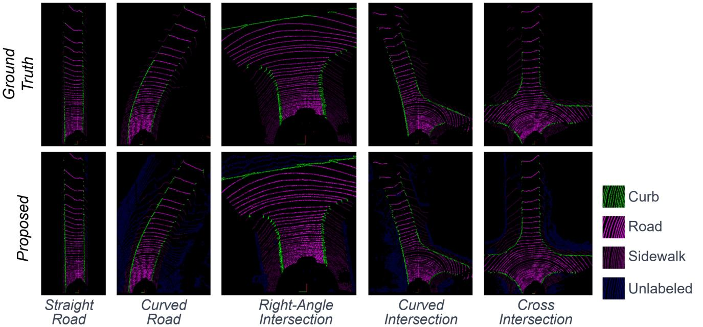

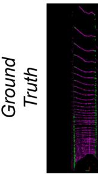

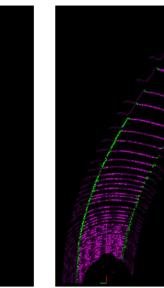

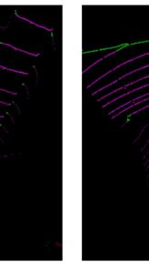

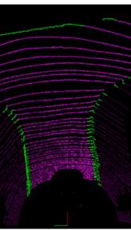

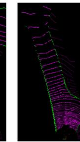

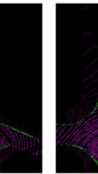

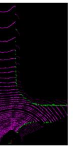

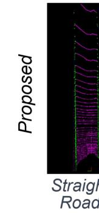

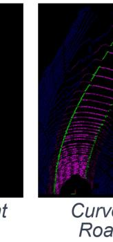

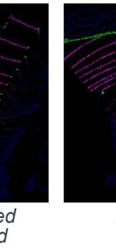

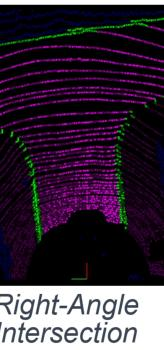

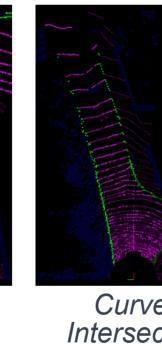

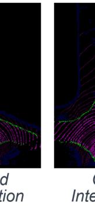

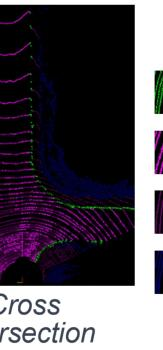

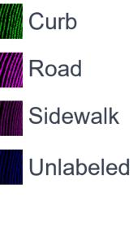

Fig. 6. Curb detection result in 3D-Curb dataset. We compared the curb detection results at five classic intersections. The model accurately detected the curb area and was even better than the ground truth on the curve road.
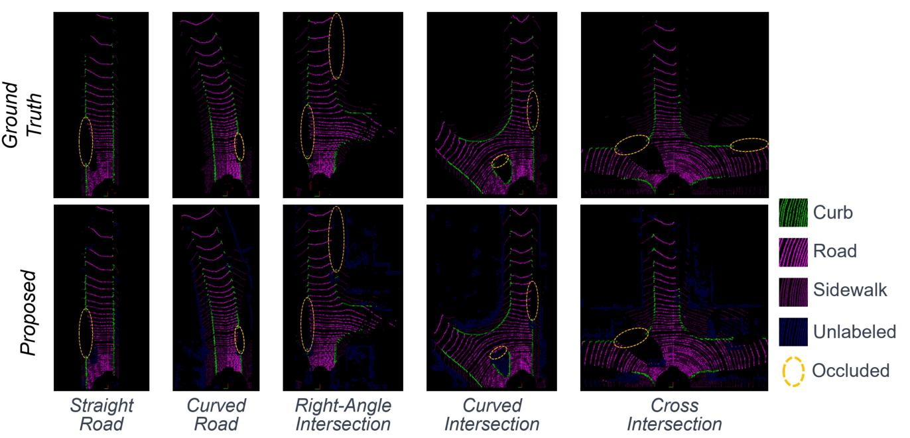

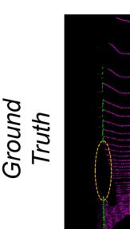

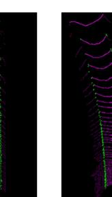

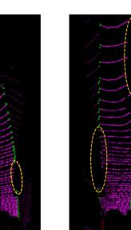

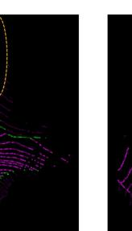

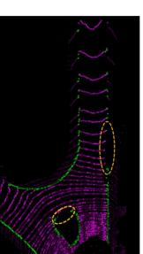

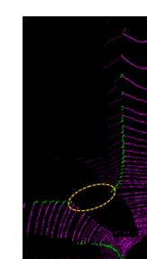

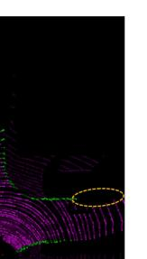

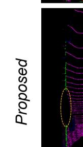

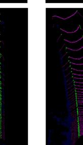

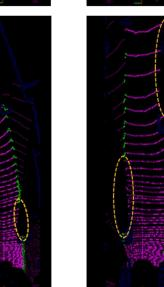

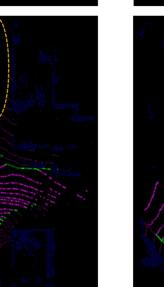

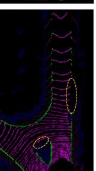

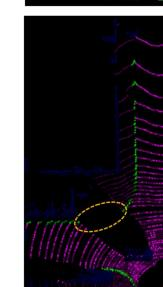

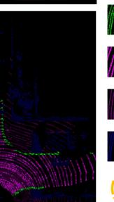

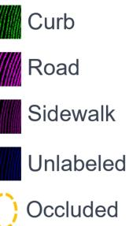

Fig. 7. Curb detection result in 3D-Curb dataset under occlusion. We compared the curb detection results at five classic intersections with occlusion. Even under occlusion, it does not affect curb detection in other areas.