IEEE TRANSACTIONS ON INTELLIGENT TRANSPORTATION SYSTEMS
10
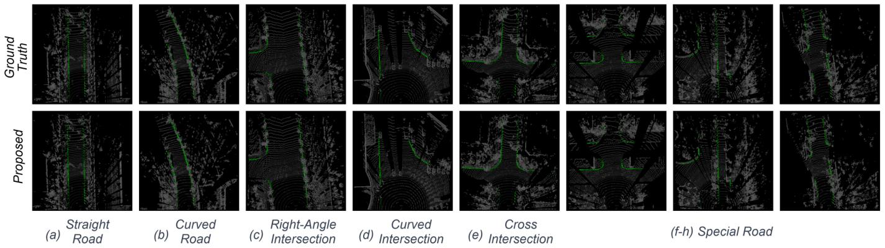

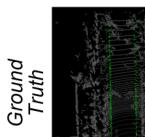

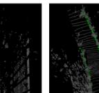

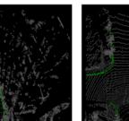

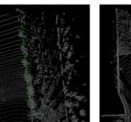

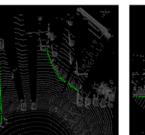

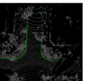

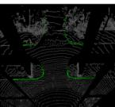

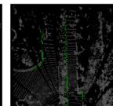

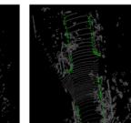

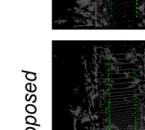

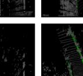

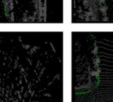

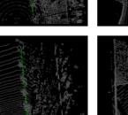

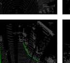

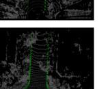

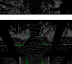

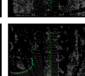

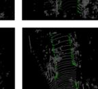

Fig. 8. Curb detection result in NRS Dataset. The excellent detection performance and generalization of the proposed method are well demonstrated on the NRS dataset, and accurate detection can be performed even at the special intersection (f-h).
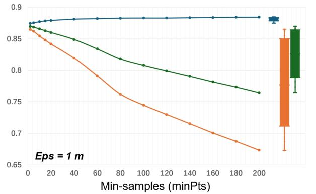

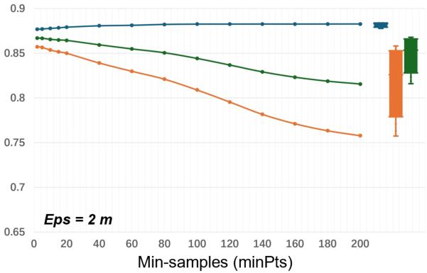

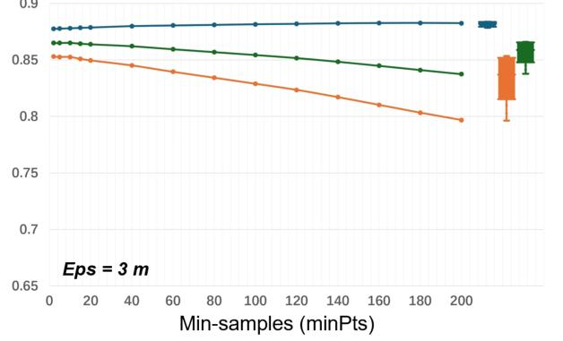

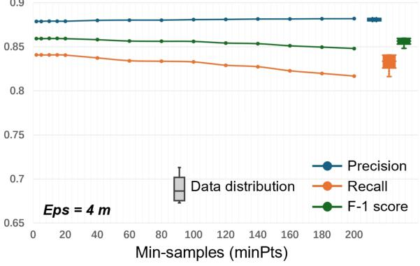

Fig. 9. Parameter adjustment experiments for multiple clustering and fitting. We conduct control variable experiments on the main parameter distance variable Eps and the minimum sample point variable minPts of DBSCAN clustering.
Based on comparative experimental results and trade-off between metrics, smaller Eps distances and fewer minPts numbers yield the most optimal post-processing outcomes.
E. Ablation Study
As shown in Table V, this study conducted comparative ablation experiments focusing on the main loss functions and crucial module designs of our model. We first conducted individual experiments on the employed  \( L_{CE} \)  (Cross-Entropy Loss),  \( L_{FL} \)  (Focal Loss),  \( L_{ACE} \)  (Adaptive Cross-Entropy Loss), and  \( L_{IoU} \)  (Intersection over Union Loss). Subsequently, we tested combinations of  \( L_{CE} + L_{IoU} \)  loss,  \( L_{FL} + L_{IoU} \)  loss and  \( L_{ACE} + L_{IoU} \)  loss. In the experimental results, due to the design of the  \( L_{ACE} \)  loss addressing the imbalance in the number of curb point clouds compared to other categories, its disproportionate weight settings caused the model to overly focus on recall during training. However, the interaction with
the  \( L_{IoU} \)  loss led to a more balanced overall performance, achieving optimal detection capabilities. The combination of  \( L_{ACE}+L_{IoU} \)  loss outperformed the  \( L_{CE}+L_{IoU} \)  loss group by 1.3 points in Precision and 2.2 points in Recall. It also surpassed the  \( L_{FL}+L_{IoU} \)  loss group with improvements of 0.7 points in Precision and 2 points in Recall.
Finally, we compared the model's performance with and without the MSCA module. When the MSCA module was not utilized, the model relied on the original encoder-decoder structure from Cylinder3D [41]. Under the \(\mathcal{L}_{ACE} + \mathcal{L}_{IoU}\) loss setting, the inclusion of the MSCA module significantly enhanced the performance metrics, particularly increasing Recall by 2 points and the F-1 score by 1 point, which further demonstrates the MSCA module's effectiveness in improving curb detection performance.