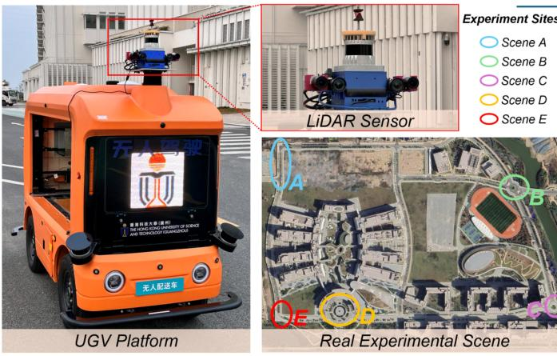

IEEE TRANSACTIONS ON INTELLIGENT TRANSPORTATION SYSTEMS
11
TABLE V ABLATION OF DIFFERENT LOSS FUNCTIONS AND MODULES
<table><tr><td>\( \mathcal{L}_{CE} \)</td><td>\( \mathcal{L}_{FL} \)</td><td>\( \mathcal{L}_{ACE} \)</td><td>\( \mathcal{L}_{IoU} \)</td><td>MSCA</td><td>Precision</td><td>Recall</td><td>F-1</td></tr><tr><td>√</td><td></td><td></td><td></td><td>√</td><td>0.8174</td><td>0.8303</td><td>0.8238</td></tr><tr><td></td><td>√</td><td></td><td></td><td>√</td><td>0.8196</td><td>0.8346</td><td>0.8273</td></tr><tr><td></td><td></td><td>√</td><td></td><td>√</td><td>0.7933</td><td>0.8707</td><td>0.8355</td></tr><tr><td></td><td></td><td></td><td>√</td><td>√</td><td>0.8234</td><td>0.8367</td><td>0.8339</td></tr><tr><td>√</td><td></td><td></td><td>√</td><td>√</td><td>0.8186</td><td>0.8472</td><td>0.8374</td></tr><tr><td></td><td>√</td><td></td><td>√</td><td>√</td><td>0.8241</td><td>0.8498</td><td>0.8401</td></tr><tr><td></td><td></td><td>√</td><td>√</td><td></td><td>0.8297</td><td>0.8496</td><td>0.8395</td></tr><tr><td></td><td></td><td>√</td><td>√</td><td>√</td><td>0.8311</td><td>0.8695</td><td>0.8499</td></tr></table>

Fig. 10. Setup of real scene experiment. We used the delivery vehicle equipped with LiDAR to conduct real scene experiments. There are a total of five experimental sections distributed on the HKUST Guangzhou campus.
F. Real Scene Experiment
To further validate the performance and effectiveness of the proposed method, we conducted real-world experiments in addition to the dataset experiments. As depicted in Fig. 10, we utilized an autonomous delivery vehicle as our experimental platform, equipping it with a LiDAR sensor system mounted on its top. The LiDAR used was the OS1-U model with 128 lines, manufactured by Ouster. To ensure the generalizability of our experiments, the autonomous vehicle was driven on roads within the HKUST Guangzhou campus. Data collection and curb detection were carried out in five different road segments (Scene A, B, C, D, and E), as shown in the map in Fig. 10. These segments included both standard road scenarios (straight roads, bends, and intersections) and complex ones (roundabout turns, and intersections) junctions.
The curb detection results in the 5 scenes are illustrated in Fig. 11, where we selected 8 representative images from each scene for visual analysis. Overall, our method achieved commendable curb detection results in each scene, further demonstrating the robust curb feature extraction capability of the CurbNet model. In individual cases, our proposed method accurately detected not only the evident, extensive curbs, but also achieved remarkable results on small-scale curbs, which are typically less conspicuous and easily overlooked, as seen in Scene B (image d) and Scene D (images b and c). This success can be attributed to the model's design focusing on multi-scale feature fusion and height channel feature extraction. Similarly,
TABLE VI
RESULTS IN FIVE REAL SCENES.
<table><tr><td>Site</td><td>Precision</td><td>Recall</td><td>F-1 score</td></tr><tr><td>Scene A</td><td>0.8331</td><td>0.8821</td><td>0.8569</td></tr><tr><td>Scene B</td><td>0.8950</td><td>0.8123</td><td>0.8517</td></tr><tr><td>Scene C</td><td>0.8610</td><td>0.8366</td><td>0.8530</td></tr><tr><td>Scene D</td><td>0.8018</td><td>0.8533</td><td>0.8268</td></tr><tr><td>Scene E</td><td>0.8579</td><td>0.8388</td><td>0.8483</td></tr><tr><td>All Scene</td><td>0.8462</td><td>0.8443</td><td>0.8453</td></tr></table>
our method also exhibited superior detection performance in complex intersection scenarios with irregular curb distributions (Scene B and Scene C). Particularly in Scene B, the method precisely detected all curbs present in the LiDAR point cloud.
Finally, we also quantitatively evaluate the real scene experiments by testing key metrics, as shown in Table VI. By comparing with manually annotated ground truth, Curb-Net achieved an average Precision, Recall, and F1 score of 0.8462, 0.8443, and 0.8453, respectively, across the five scenes. Among them, the Recall and F-1 score indicators obtained in Scene A are the highest, which are 0.8821 and 0.8569 respectively, and the Precision indicator obtained in Scene B is the highest 0.8950. These results corroborate with those obtained from dataset testing, further substantiating the excellent performance and generalizability of the CurbNet.
G. Time Consumption
In practical applications for intelligent vehicles, real-time curb detection is critical. As shown in Table VII, we evaluated the time consumption for both the model inference and post-processing stages of our curb detection framework. To ensure the efficiency of the entire processing framework, the model inference is executed on the GPU, while the post-processing runs on the CPU.
In various scenarios, since the LiDAR used and the number of input point clouds are different, the time consumption of computational processing is also different. Nevertheless, the CurbNet framework consistently achieves an overall real-time performance exceeding 15 Hz during both model inference and post-processing stages. Notably, the post-processing stage operates faster than the model inference stage, ensuring the smooth and efficient operation of the entire framework.
Furthermore, we evaluated the real-time performance of CurbNet on an on-board processing unit, specifically the NVIDIA Jetson AGX Orin [55], which provides up to 275 TOPS of computational power with INT8 precision. Through model optimization using TensorRT and INT8 precision inference, the CurbNet achieved a processing speed exceeding 20 FPS on this device. These results underscore the feasibility of deploying CurbNet on modern edge computing platforms, ensuring real-time curb detection even under resource-constrained conditions. This highlights the practicality of CurbNet for real-world autonomous driving applications.