IEEE TRANSACTIONS ON INTELLIGENT TRANSPORTATION SYSTEMS
12
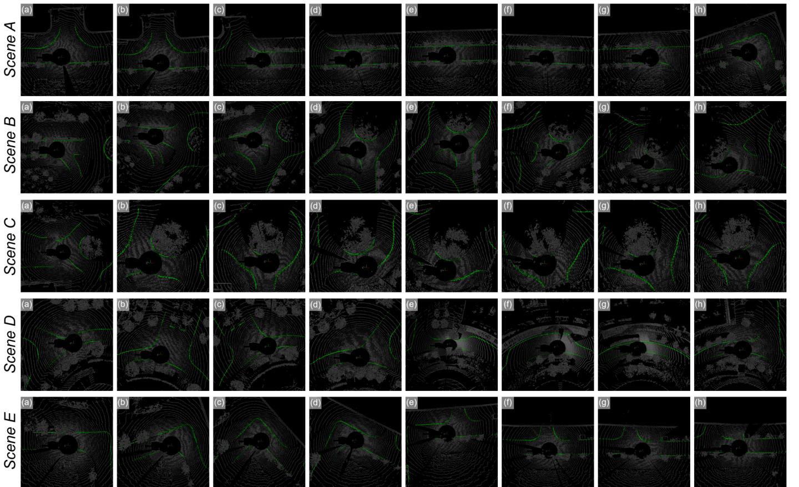

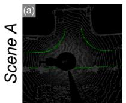

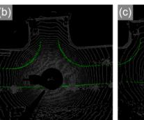

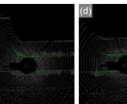

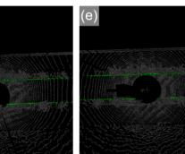

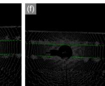

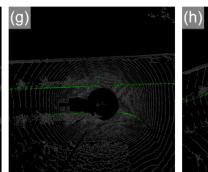

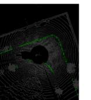

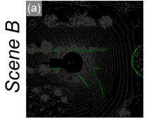

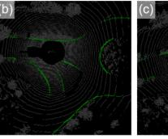

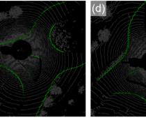

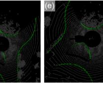

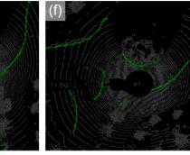

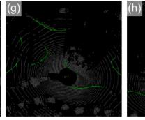

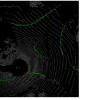

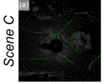

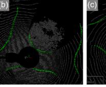

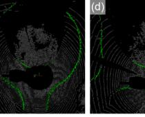

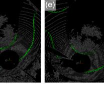

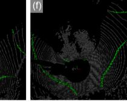

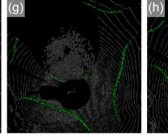

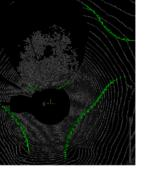

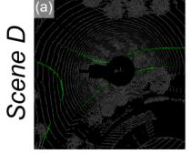

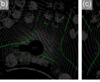

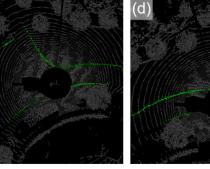

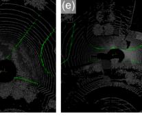

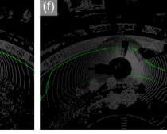

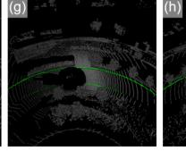

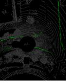

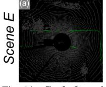

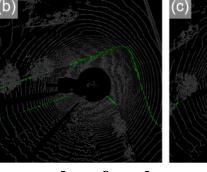

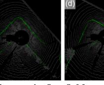

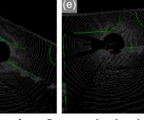

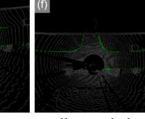

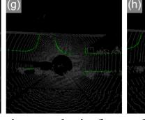

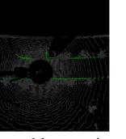

Fig. 11. Curb detection results of real experiments in five field scenarios. Our method achieves excellent curb detection results in five real-world scenarios. In particular, it also shows excellent performance in complex intersection scenarios B and C with irregular curb distribution.
TABLE VII COMPARISON OF TIME CONSUMPTION IN MODEL INFERENCE AND POST-PROCESSING, THE UNIT IS (FPS/MS).
<table><tr><td>Stage</td><td>3D-Curb</td><td>NRS</td><td>Real Scene</td></tr><tr><td>Model Inference</td><td>20.69 / 48.33</td><td>18.18 / 55.01</td><td>16.22 / 61.65</td></tr><tr><td>Post-Processing</td><td>26.96 / 37.09</td><td>26.08 / 38.34</td><td>19.02 / 52.58</td></tr></table>
V. LIMITATION
While the method presented in this paper demonstrates effective and accurate detection of curbs in road scenes, thus providing a basis for navigable area determination for autonomous driving, it currently has limitations in detecting curbs solely within the LiDAR point cloud. Due to factors such as the scanning angle, field of view, and obstructions inherent to LiDAR technology, some road areas remain undetected in the point cloud, leading to an inability of the model to extract corresponding curb features. This necessitates future research involving more advanced sensors to minimize scanning blind spots. Additionally, the development of a model incorporating a curb prediction module that operates effectively in areas without scanning blind spots is essential to mitigate the impact of these blind spots on curb detection.
VI. CONCLUSION
In this paper, we established the 3D-Curb dataset, comprising 7,100 frames. To our knowledge, this is currently the largest and most diverse curb point cloud dataset with the
most extensive range of annotated categories. Notably, this is also the first dataset to feature 3D point cloud annotations for curbs, which will significantly aid future related research. Within the CurbNet framework, we introduced the Multi-Scale and Channel Attention (MSCA) module, addressing the challenges of uneven distribution of curb features and the reliance on high-frequency z-axis features. Additionally, we introduce a novel adaptive loss function group to resolve the imbalance in the number of curb point clouds relative to other categories. Extensive experiments on both the NRS and 3D-Curb datasets demonstrated that our approach outperforms the current leading curb detection and point cloud segmentation models. In the tolerance experiments, CurbNet achieved over 0.95 average performance in Precision, Recall, and F-1 score metrics at just 0.15m tolerance, setting a new standard. Furthermore, our post-processing approach of multi-clustering and curve fitting effectively eliminated noise in the curb results, enhancing the Precision, Recall, and F-1 score metrics to 0.8744, 0.8648, and 0.8696, respectively. Finally, the excellent detection performance and generalization of our proposed method were further verified in real scene experiments.
The 3D-Curb dataset and the CurbNet framework established in this study lay a foundation for future research in curb detection. In our upcoming research, we plan to create a more comprehensive dataset incorporating additional modalities. Similarly, we aim to explore and enhance the capabilities of the CurbNet framework, improving its performance in multimodal data contexts.